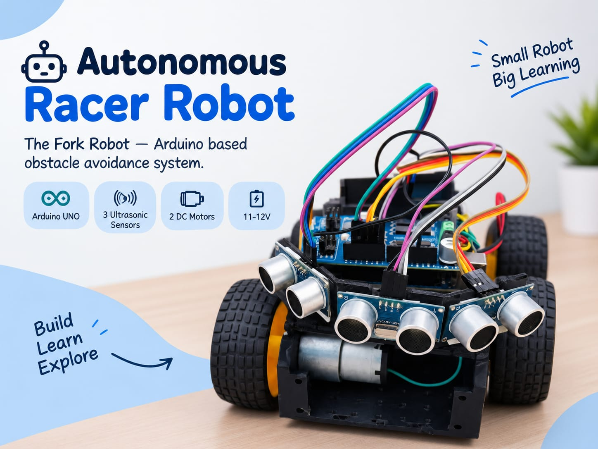
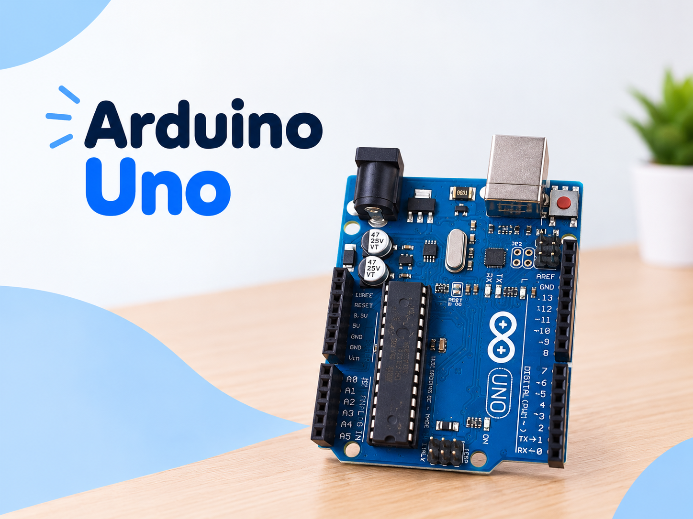
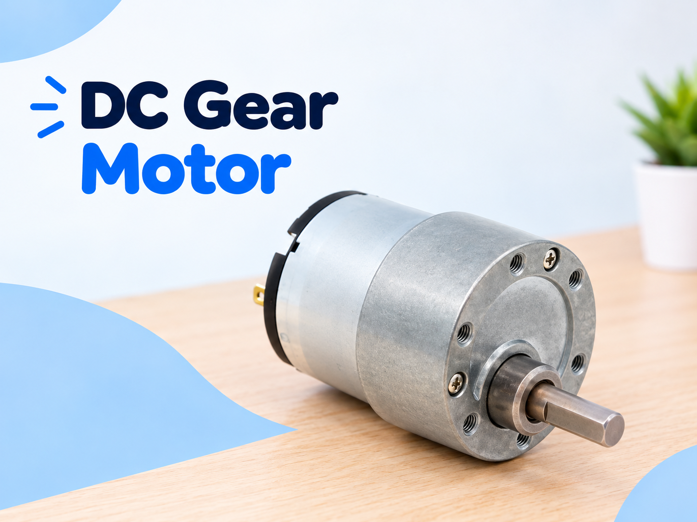
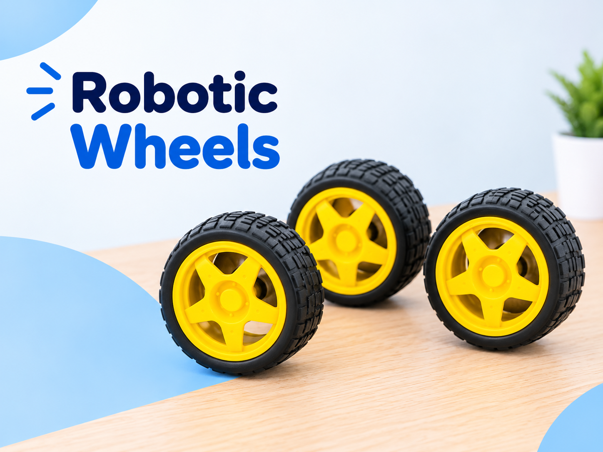
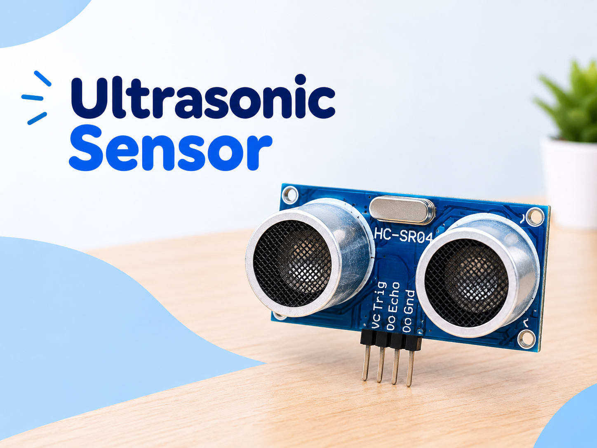
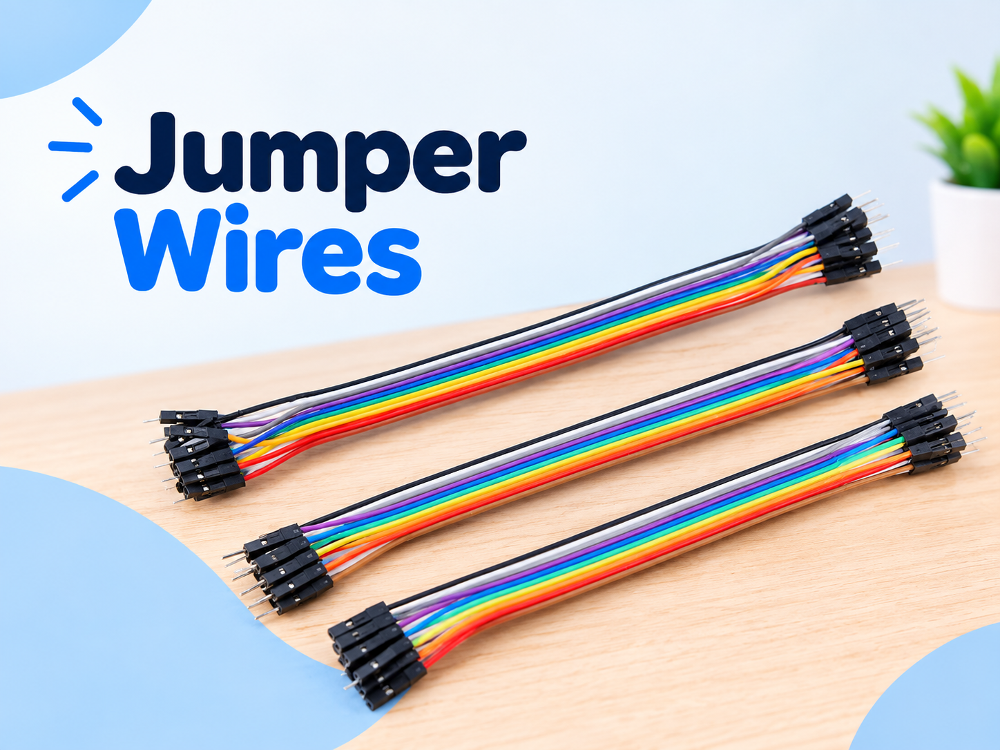

# 🤖 Autonomous Racer Robot (Fork Robot) — Guidance & Documentation

[](https://www.arduino.cc/)
[](https://isocpp.org/)
[](https://creativekhan123.github.io/Racerbot-Guidance/)
[](./Autonomous_Racer_Robot.html)
[]()
[]()
[]()

> **Teacher-friendly assembly, wiring, logic, and code guidance for building an autonomous obstacle-avoiding racer robot.**

---

## 📸 Project Showcase

<div align="center">
  
  <p><em>The assembled Autonomous Racer Robot ("Fork Robot") equipped with 3 forward-facing ultrasonic sensors, Cytron motor shield, and geared drive motors.</em></p>
</div>

---

## 📑 Table of Contents

- [Project Overview](#-project-overview)
- [Interactive Documentation Webpage](#-interactive-documentation-webpage)
- [Hardware Components](#-hardware-components)
- [Component Gallery](#-component-gallery)
- [Circuit & Wiring Guide](#-circuit--wiring-guide)
  - [Ultrasonic Sensors](#1-ultrasonic-sensor-connections)
  - [Motor Driver Shield & Motors](#2-motor-driver-shield-connections)
  - [Power Supply](#3-power-supply-connections)
- [How It Works (Autonomous Logic)](#-how-it-works-autonomous-logic)
- [Arduino Source Code](#-arduino-source-code)
- [Assembly & Setup (9 Steps)](#-assembly--setup-steps)
- [Pre-Flight Testing Checklist](#-pre-flight-testing-checklist)
- [Safety & Battery Guidelines](#-safety--battery-guidelines)
- [Author & License](#-author--license)

---

## 🎯 Project Overview

The **Autonomous Racer Robot** (nicknamed **"Fork Robot"** due to its three forward-pointing sensor mounts resembling a fork) is an intelligent, self-navigating mobile robot built using an **Arduino UNO** microcontroller board.

### Key Capabilities:
- **3-Way Real-Time Radar Perception**: Continuously scans distance on the **Left**, **Center**, and **Right** using three HC-SR04 ultrasonic sensors.
- **Dynamic Obstacle Avoidance**: Automatically steers away from walls, obstacles, and dead ends without human intervention.
- **Differential Drive Steering**: Uses two high-torque 12V DC gear motors with PWM speed control for agile turning and smooth straight-line racing.
- **Beginner & Classroom Friendly**: Uses standard Arduino libraries and straightforward C++ control loops, making it an ideal STEM robotics project.

---

## 🌐 Interactive Documentation Webpage

This repository includes a **complete, standalone interactive documentation webpage**:

📄 **[`Autonomous_Racer_Robot.html`](./Autonomous_Racer_Robot.html)**

### Webpage Highlights:
- **100% Self-Contained**: Works offline by simply double-clicking the file in any browser (Chrome, Edge, Safari, Firefox). All images and styles are embedded.
- **Dark Mode & Light Mode**: Built-in toggle button in the navbar and a thumb-friendly floating action button (FAB).
- **Mobile & Android Responsive**: Specially optimized layout that renders cleanly on smartphones and tablets.
- **Interactive Component Gallery Grid**: Click any component card to reveal detailed specifications and teacher notes.
- **One-Click Code Copy**: Easily copy the full Arduino code into the Arduino IDE.
- **Interactive Testing Checklist**: Check off testing steps before deployment.
- **Print Friendly**: Formatted for printing physical classroom handouts.

---

## 🛠 Hardware Components

| Component | Specification | Qty | Function in Robot |
| :--- | :--- | :---: | :--- |
| **Arduino UNO** | ATmega328P, 5V, 16 MHz | 1 | Central controller executing sensor logic and motor commands |
| **Motor Driver Shield** | Cytron 2-Channel H-Bridge | 1 | High-current interface driving the dual DC motors safely |
| **DC Gear Motors** | JGB37-520, 12V, 960 RPM | 2 | Heavy-duty all-metal geared motors providing drive torque |
| **Rubber Wheels** | Direct-fit treaded tyres | 2 | High-traction drive wheels attached to motor shafts |
| **Ultrasonic Sensors** | HC-SR04 (40 kHz sound) | 3 | 3-way distance measurement (Left, Center, Right) |
| **Robot Chassis** | 2WD laser-cut acrylic base | 1 | Structural skeleton holding all modules and caster wheel |
| **Battery Pack** | 11.1V – 12V Li-ion / 3S pack | 1 | Provides high-current power for motors and Arduino |
| **Jumper Wires** | DuPont Male-to-Female & M-M | ~20 | Signal and power interconnects between boards and sensors |

---

## 🖼 Component Gallery

<table align="center">
  <tr>
    <td align="center" width="50%">
      <br/>
      <strong>Arduino UNO</strong><br/>
      <em>Main Microcontroller &middot; Brain</em>
    </td>
    <td align="center" width="50%">
      <br/>
      <strong>Motor Driver Shield (Cytron)</strong><br/>
      <em>Dual H-Bridge Motor Control</em>
    </td>
  </tr>
  <tr>
    <td align="center" width="50%">
      <br/>
      <strong>JGB37-520 DC Gear Motors</strong><br/>
      <em>12V High-Torque 960 RPM Geared Motors</em>
    </td>
    <td align="center" width="50%">
      <br/>
      <strong>High-Traction Rubber Wheels</strong><br/>
      <em>Anti-Slip Treaded Drive Wheels</em>
    </td>
  </tr>
  <tr>
    <td align="center" width="50%">
      <br/>
      <strong>HC-SR04 Ultrasonic Sensors &times;3</strong><br/>
      <em>Acoustic 3-Way Distance Sensors</em>
    </td>
    <td align="center" width="50%">
      <br/>
      <strong>DuPont Jumper Wires</strong><br/>
      <em>Color-Coded Solderless Interconnects</em>
    </td>
  </tr>
</table>

---

## 🔌 Circuit & Wiring Guide

### 1. Ultrasonic Sensor Connections

All three HC-SR04 sensors share the standard `5V` and `GND` power rails from the shield. Signal pins are connected to Arduino analog pins configured as digital I/O:

| Sensor Position | Sensor Pin | Arduino Pin | Pin Function |
| :--- | :--- | :--- | :--- |
| **Left Sensor** | `VCC` | `5V` | 5V Power |
| **Left Sensor** | `GND` | `GND` | Ground |
| **Left Sensor** | `TRIG` | `A0` (D14) | Trigger output pulse |
| **Left Sensor** | `ECHO` | `A1` (D15) | Echo input signal |
| **Center Sensor** | `VCC` | `5V` | 5V Power |
| **Center Sensor** | `GND` | `GND` | Ground |
| **Center Sensor** | `TRIG` | `A2` (D16) | Trigger output pulse |
| **Center Sensor** | `ECHO` | `A3` (D17) | Echo input signal |
| **Right Sensor** | `VCC` | `5V` | 5V Power |
| **Right Sensor** | `GND` | `GND` | Ground |
| **Right Sensor** | `TRIG` | `A4` (D18) | Trigger output pulse |
| **Right Sensor** | `ECHO` | `A5` (D19) | Echo input signal |

---

### 2. Motor Driver Shield Connections

The Cytron motor driver shield connects directly onto the Arduino UNO header pins. Terminal blocks connect to the DC motors:

| Terminal / Pin | Connected To | Arduino Signal Pin | Description |
| :--- | :--- | :--- | :--- |
| **Motor 1 (+) / (-)** | Left DC Motor | `PWM = D9`, `DIR = D8` | Left motor speed & direction |
| **Motor 2 (+) / (-)** | Right DC Motor | `PWM = D11`, `DIR = D12` | Right motor speed & direction |

---

### 3. Power Supply Connections

| Terminal | Power Wire | Voltage | Notes |
| :--- | :--- | :--- | :--- |
| **Shield VIN (+)** | Battery Red Wire (+) | `+11V to +12V` | **Verify polarity before connecting!** |
| **Shield GND (-)** | Battery Black Wire (-) | `0V (GND)` | Common ground reference |

> ⚠️ **IMPORTANT POWER SAFETY**:
> - Always double-check battery polarity (`+` to `+`, `-` to `-`). Reversing polarity can permanently damage the shield and Arduino.
> - Never connect the 11–12V battery directly to Arduino 5V or signal pins. Always connect battery power to the shield's external power terminals.

---

## 🧠 How It Works (Autonomous Logic)

The robot operates using a continuous sense-think-act control loop:

```
[Start Loop]
     │
     ▼
[Read 3 Ultrasonic Sensors] (Left, Center, Right in cm)
     │
     ├───────────────────────────────────────────────────────┐
     │                                                       │
     ▼                                                       ▼
[Center < 20 cm?]                                      [Center Clear (>= 20 cm)]
     │ YES                                                   │
     ▼                                                       ├─ Left < 30 cm?  ──► Turn RIGHT
[Reverse & Turn]                                             ├─ Right < 30 cm? ──► Turn LEFT
(Back up, then spin toward the open side)                    └─ Both Clear?    ──► Drive FORWARD
```

### Decision Matrix:

| Sensor Condition | Distance Thresholds | Robot Behavior | Left Motor | Right Motor |
| :--- | :--- | :--- | :---: | :---: |
| **Path Ahead Clear** | Center &ge; 20cm, Left & Right &ge; 30cm | Drive straight forward | `FORWARD (PWM 200)` | `FORWARD (PWM 200)` |
| **Obstacle on Left** | Left &lt; 30cm, Right &ge; 30cm | Steer right into open space | `FORWARD (PWM 200)` | `REVERSE (PWM 150)` |
| **Obstacle on Right** | Right &lt; 30cm, Left &ge; 30cm | Steer left into open space | `REVERSE (PWM 150)` | `FORWARD (PWM 200)` |
| **Dead End / Corner** | Center &lt; 20cm | Reverse back, then pivot turn | `REVERSE (PWM 180)` | `REVERSE (PWM 180)` |

---

## 💻 Arduino Source Code

The full, tested Arduino sketch is located at:

📁 **[`arduino_code/arduino_code.ino`](./arduino_code/arduino_code.ino)**

### Code Highlights:
- **Zero External Dependencies**: Uses built-in `pulseIn()` and `digitalWrite()`. No third-party libraries needed.
- **Clear Distance Function**: `readDistance(trigPin, echoPin)` triggers a 10µs pulse and calculates distance in centimeters (`duration * 0.034 / 2`).
- **Modular Movement Routines**:
  - `moveForward(speed)`
  - `turnLeft(speed)`
  - `turnRight(speed)`
  - `moveBackward(speed)`
  - `stopMotors()`
- **Serial Debugging**: Prints live sensor distances (`Left`, `Center`, `Right`) to the Serial Monitor at `9600 baud` for easy troubleshooting.

---

## 🔨 Assembly & Setup Steps

1. **Prepare Chassis**: Unpack the acrylic base and identify mounting slots for motors, Arduino, and sensors.
2. **Mount Motors & Wheels**: Secure the two JGB37-520 motors onto chassis brackets using screws. Press rubber wheels onto the motor D-shafts.
3. **Mount Arduino & Shield**: Stack the Cytron motor driver shield firmly onto the Arduino UNO headers. Fasten the stack to the chassis.
4. **Mount 3 Ultrasonic Sensors**: Fix one sensor at Left, one at Center, and one at Right facing horizontally forward.
5. **Connect Sensor Wiring**: Connect VCC&rarr;5V, GND&rarr;GND, and TRIG/ECHO lines to pins A0 through A5 as specified in the wiring table.
6. **Connect Motor Terminals**: Connect left motor leads to Motor 1 terminals, right motor leads to Motor 2 terminals.
7. **Connect Power Supply**: Connect the 11–12V battery pack to the shield's screw terminals. **Carefully check polarity before tightening.**
8. **Upload Arduino Program**: Connect the Arduino to your computer via USB, open `arduino_code.ino` in the Arduino IDE, select Board: **Arduino UNO**, select your COM port, and click **Upload**.
9. **Field Test**: Place the robot on a flat, clear floor, switch on battery power, and watch it navigate and steer around obstacles!

---

## ✅ Pre-Flight Testing Checklist

Go through this checklist before letting the robot run freely:

- [ ] Arduino UNO powers on (green power LED lit)
- [ ] Motor driver shield power LED indicates steady supply
- [ ] Battery polarity verified (`+` Red, `-` Black)
- [ ] Left motor rotates forward when commanded
- [ ] Right motor rotates forward when commanded
- [ ] Left ultrasonic sensor displays accurate distance on Serial Monitor
- [ ] Center ultrasonic sensor displays accurate distance on Serial Monitor
- [ ] Right ultrasonic sensor displays accurate distance on Serial Monitor
- [ ] Robot drives forward when path is clear
- [ ] Robot turns right when an obstacle is placed near the left sensor
- [ ] Robot turns left when an obstacle is placed near the right sensor
- [ ] Robot reverses and spins when an obstacle is placed &lt; 20 cm in front
- [ ] All jumper wires and screw terminals are mechanically secure

---

## ⚠️ Safety & Battery Guidelines

- **Polarity Warning**: Never reverse battery polarity. Reversing `+` and `-` will burn the driver IC immediately.
- **Short-Circuit Prevention**: Keep bare wire strands trimmed and covered with insulation tape or heat shrink.
- **Voltage Separation**: Never feed 11–12V directly into Arduino I/O pins (pins operate at 5V logic only).
- **Mechanical Safety**: Keep fingers, hair, and loose wires away from spinning wheels and motor gears while powered.
- **Safe Testing Area**: Test the robot on an open, flat floor away from staircases, table edges, and drop-offs.

---

## 👤 Author & License

- **Author**: Mohd Zeeshan ([@Creativekhan123](https://github.com/Creativekhan123))
- **Project**: Autonomous Racer Robot ("Fork Robot")
- **License**: [MIT License](LICENSE) &mdash; Free for educational, student, and personal use.
